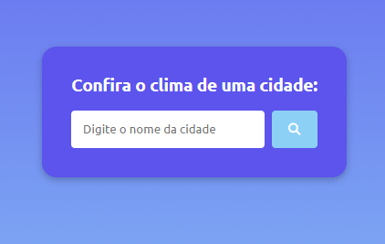
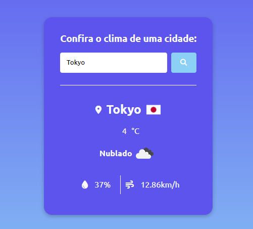

# Weather App




## Descrição
O **Weather App** é uma aplicação web que permite aos usuários obter informações meteorológicas de diversas cidades ao redor do mundo. Utiliza a API do <a src="https://openweathermap.org/">**OpenWeatherMap**<a> para fornecer dados atualizados sobre temperatura, umidade, condição climática e mais.

## Tecnologias Utilizadas
- **Frontend:** HTML, CSS e JavaScript puros
- **API de Clima:** OpenWeatherMap

## Funcionalidades
- Buscar previsão do tempo por cidade
- Exibir temperatura, umidade e condição climática
- Interface responsiva e amigável

## Como Usar
1. Clone este repositório:
   ```bash
   git clone https://github.com/FelipeSDS23/Weather_app-.git
   ```
2. Abra o arquivo `index.html` em seu navegador.
3. Para utilizar a aplicação, é necessário inserir sua chave de API do OpenWeatherMap no arquivo JavaScript.
   - A chave pode ser gerada em: <a src="https://openweathermap.org/api">OpenWeatherMap API Key<a>
   - Insira sua chave na constante `apiKey` no arquivo js/script.js.